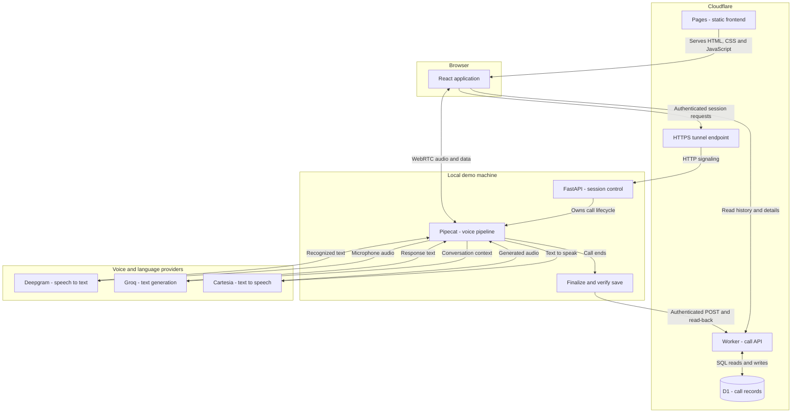
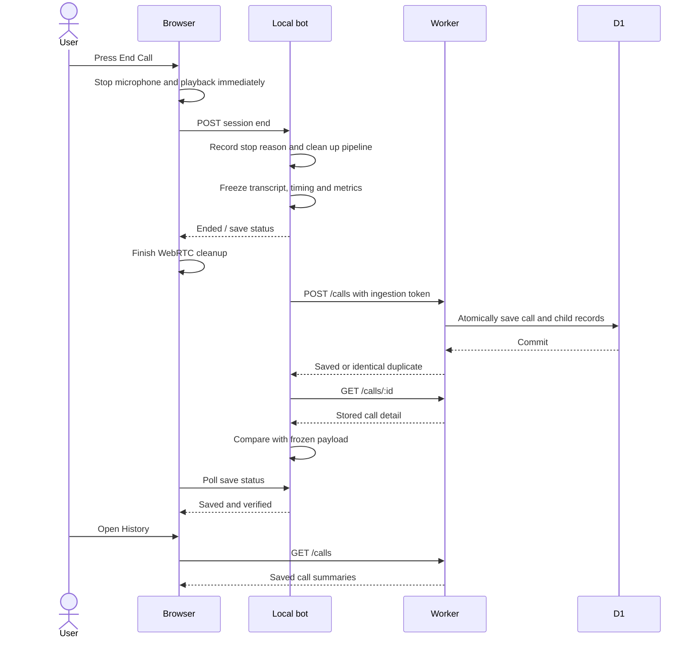
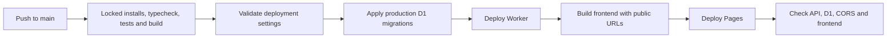

# Vaami — Voice Agent & Call Log

Talk to an AI agent in your browser, end the call, and revisit its transcript and
latency measurements. This project implements the Vaami intern take-home using
Cloudflare Pages, Workers and D1, with Pipecat running locally.

[**Live application**](https://vaaami-project.pages.dev) ·
[**Call history**](https://vaaami-project.pages.dev/#/calls) ·
[**Deployment runs**](https://github.com/gamea333/vaaami_project/actions) ·
[**API health**](https://vaami-call-log-api-production.mehraaditya777.workers.dev/health)

> **Demo availability:** saved history is hosted on Cloudflare. Voice calls also
> require the local bot and its HTTPS tunnel to be running. Obtain the demo access
> code from the project owner; provider API keys are never entered in the browser.

## What the application does

- Starts a microphone conversation with streaming speech recognition, LLM replies and synthesized speech.
- Supports interruptions through Pipecat and records interruption labels in transcripts.
- Stops calls at configured time, inactivity and usage limits.
- Saves connected calls with metadata, user/assistant turns and available latency samples.
- Provides paginated history and refreshable detail URLs, including save recovery and error states.
- Deploys database migrations, the Worker and Pages through GitHub Actions.

## Architecture

The frontend is hosted on Cloudflare, while the voice pipeline runs on the demo
machine. The Worker handles stored call data; it does not run the speech pipeline.



**Three separate paths make this work:**

1. **Session control:** the browser sends authenticated HTTPS requests through the
   tunnel to create, negotiate and end a local bot session.
2. **Live conversation:** WebRTC connects the browser and Pipecat. Pipecat streams
   audio to Deepgram, passes recognized text and context to Groq, and sends generated
   text to Cartesia. Audio returns to the browser through WebRTC.
3. **Persistence:** the bot freezes the finished call, uploads it to the Worker,
   and verifies the stored result. The browser reads history directly from the Worker.

The tunnel carries HTTP signaling, **not WebRTC audio**. Optional STUN discovers
public network candidates. Restrictive networks may require TURN; TURN is not
configured. D1 is the only persistent application database. Raw audio is not stored.

### What happens when a call ends



Upload and UI status requests can overlap. End Call acknowledges the intentional
hangup before browser transport cleanup, avoiding the previous disconnect-label
race. If the end request fails, transport cleanup still runs and the UI reports
unconfirmed cleanup rather than promising a successful hangup.

## Technology choices

| Layer | Technology | Responsibility |
| --- | --- | --- |
| Frontend | React, TypeScript, Vite | Call controls, transcripts, history and detail screens |
| Hosting | Cloudflare Pages | Serves the built frontend |
| API | Cloudflare Workers, TypeScript | Validation, authenticated ingestion, reads and request logs |
| Database | Cloudflare D1 | Calls, ordered transcript turns and latency samples |
| Bot server | Python 3.12, FastAPI, Pipecat | Session lifecycle and streaming voice pipeline |
| Transport | Pipecat SmallWebRTC | Browser audio; no Daily account required |
| Speech recognition | Deepgram, default `nova-3` | Streaming speech-to-text |
| Language model | Groq, default `openai/gpt-oss-20b` | Contextual replies |
| Speech synthesis | Cartesia, default `sonic-3.6` | Streaming text-to-speech with a configured voice ID |
| Deployment | Wrangler, GitHub Actions | Migrations, checks and cloud deployment |

Versions are locked in `package-lock.json` and `bot/uv.lock`. Models and the voice
ID are configurable through the bot environment.

## Assessment requirements and verification

| Requirement | Implementation and evidence |
| --- | --- |
| Pages frontend, Worker API, D1 only | Deployed to Cloudflare; production persistence verified |
| Wrangler and migrations | Local development plus a separate production D1 binding |
| GitHub Actions on pushes to main | Successful check, migration, Worker and Pages deployment runs |
| Local Pipecat with required providers | Deepgram + Groq + Cartesia + SmallWebRTC |
| Browser conversation | Live-site voice and saving confirmed by the project owner |
| Handle interruptions | Implemented; transcript handling tested offline; spoken interruption acceptance pending |
| Call ID, start/end, duration and transcript | Stored; a real production call has both user and assistant turns |
| Optional latency per stage | Real production samples captured for STT, LLM and TTS |
| Start Call, list and detail pages | Implemented, with pagination and hash routes |
| POST /calls, GET /calls, GET /calls/:id | Implemented and covered by Worker tests |
| Observability | Enabled; structured live Worker logs verified |
| Repository and README | Source, workflow, architecture, setup, tradeoffs and improvements included |

**Manual verification:** the project owner reports the other listed manual tests
passed, including intentional hangup, interruptions, unavailable bot, navigation
and narrow layout. Microphone denial exposed a startup issue: permission is now
checked before session creation, with automated denial/retry/cancellation coverage.
A fresh deployed-browser check of this correction remains pending. Dashboard log
rehearsal remains part of assessment preparation.

## Run locally

### Prerequisites

- Node.js 22.12 or newer; CI uses Node 22.
- Python 3.12 and uv in Linux/Ubuntu WSL2 for the bot.
- Git, provider credentials and a microphone. Headphones reduce feedback.
- Cloudflare authentication is needed for deployment, not local D1 development.

Commands below use PowerShell for the frontend/API. The bot runs in Ubuntu WSL2.
Adjust the WSL path if your checkout is elsewhere. Linux users can run the bot
commands directly from its directory.

### 1. Install dependencies and create local configuration

```powershell
git clone https://github.com/gamea333/vaaami_project.git
cd vaaami_project
npm ci
Copy-Item bot/.env.example bot/.env
Copy-Item apps/api/.dev.vars.example apps/api/.dev.vars
Copy-Item apps/web/.env.example apps/web/.env
```

Copy the templates only on first setup; preserve existing configured files.

In `bot/.env`, set `DEEPGRAM_API_KEY`, `GROQ_API_KEY`, `CARTESIA_API_KEY`,
`CARTESIA_VOICE_ID`, and a private `DEMO_ACCESS_CODE`. In `apps/api/.dev.vars`, set
`CALLS_INGEST_TOKEN` to a strong random value. For example, generate a value locally
with `node -e "console.log(require('node:crypto').randomBytes(32).toString('hex'))"`.
Keep the result private.

```powershell
npm run configure:bot --workspace=@vaami/api
npm run db:migrate --workspace=@vaami/api
```

The helper synchronizes the ingestion token and public local API URL without
printing credentials. On Windows it finds the Windows WSL adapter because Linux
localhost does not necessarily reach the Windows Worker.

In an Ubuntu terminal, with uv already installed:

```bash
cd /mnt/c/path/to/vaaami_project/bot
uv sync --locked --python 3.12
```

### 2. Start three services

| Terminal | Working directory | Command |
| --- | --- | --- |
| PowerShell: API | Repository root | `npm run dev:api` |
| PowerShell: frontend | Repository root | `npm run dev:web` |
| Ubuntu: bot | `bot/` | `uv run python -m uvicorn server:app --host 127.0.0.1 --port 7860` |

Open [localhost frontend](http://127.0.0.1:5173), enter the demo code, allow the
microphone and start a short call. End it, wait for **Saved and verified**, and
open History. Optional sample data: `npm run demo:seed --workspace=@vaami/api`.

Use one bot process without `--reload`. Restart after environment changes only
after resolving unfinished saves. Local D1 data and production D1 data are separate.
Additional bot details are in [bot/README.md](bot/README.md).

## Configuration and credentials

| Location | Settings | Exposure |
| --- | --- | --- |
| `bot/.env` | Provider keys, models/voice ID, demo code, ingestion token, API URL, origins and limits | Private, ignored by Git |
| `apps/api/.dev.vars` | Local ingestion token and local Worker address | Private, ignored by Git |
| Worker secret | `CALLS_INGEST_TOKEN` | Cloudflare secret; must match the bot |
| `apps/web/.env` | `VITE_API_BASE_URL`, `VITE_BOT_BASE_URL`, optional `VITE_STUN_URL` | Public values embedded at build time |
| GitHub Actions secret | `CLOUDFLAREAPI` | Deployment token, mapped to `CLOUDFLARE_API_TOKEN` by the workflow |
| GitHub Actions variables | `VITE_API_BASE_URL`, `VITE_BOT_BASE_URL`, `PAGES_URL` | Public deployment addresses |

The demo code allows new calls; random per-session tokens protect session controls.
The ingestion token allows uploads to the Worker. These are different from provider
keys. Never put private keys in `VITE_` variables. Remember on this device stores the
demo code in browser localStorage; use it only on your own device and clear it with
Forget saved code.

## API and data model

| Endpoint | Purpose | Access |
| --- | --- | --- |
| `POST /calls` | Validate and save one finalized call | Bearer ingestion token |
| `GET /calls?limit=20&offset=0` | Newest-first paginated summaries | Public demo read |
| `GET /calls/:id` | Metadata, ordered turns and measured metrics | Public demo read |
| `GET /health` | Service liveness | Public |

| D1 table | Contents |
| --- | --- |
| `calls` | ID, start/end timestamps, duration, status, end reason and creation time |
| `transcripts` | Call association, sequence, speaker, text, timestamp and interrupted flag |
| `call_metrics` | Call association, sequence, optional turn association, stage, metric, milliseconds, provider and source |

See [the SQL migration](apps/api/migrations/0001_init.sql) and
[example upload payload](packages/contracts/call.example.json) for exact fields.
Queries are parameterized and inserts are atomic. Retrying the same ID and payload
is idempotent; changing content under the same ID returns 409.

Completed means a normal recorded stop, including configured limits. Disconnected
means the browser-disconnection reason was recorded. Failed means a bot error was
recorded. These describe how a call ended, separately from whether its upload succeeded.

Metrics are individual samples in milliseconds. Missing measurements display
**Not captured**; overlapping measurements are not summed into an invented total.
Interrupted transcript text may contain generated words that did not play aloud.

## Deployment and CI/CD

The [workflow](.github/workflows/deploy.yml) runs checks on pushes to `main`, pull
requests and manual dispatch. Only `main` deploys production.



Actions are pinned to commits. Production deploy jobs are serialized and are not
canceled midway. A failed check blocks deployment. Cloud operations are sequential,
not a single atomic transaction; migrations should remain backward-compatible.
CI never starts a voice call or spends speech-provider credits.

### Provisioning another account

1. Run `npx wrangler login` and create a D1 database with Wrangler. Update the
   account ID and production database ID in [wrangler.jsonc](apps/api/wrangler.jsonc).
   Update the workflow's account ID too.
2. Create a Pages Direct Upload project. Update its name in the workflow and its
   origin in the production Worker configuration if different from this deployment.
3. Set the Worker ingestion secret interactively:

   ```powershell
   npx wrangler secret put CALLS_INGEST_TOKEN --env production --config apps/api/wrangler.jsonc
   ```

4. Add GitHub secret `CLOUDFLAREAPI` with target-account permissions for Workers
   Scripts Edit, D1 Edit, Cloudflare Pages Edit and Account Settings Read.
5. Add the three public URL variables listed above. Push to `main` and inspect Actions.

The top-level Wrangler configuration is for local development; the explicit
`production` environment selects the production Worker, database and allowed origin.

### Connect the local bot to the live site

From the repository root:

```powershell
node scripts/configure-production.mjs https://vaami-call-log-api-production.mehraaditya777.workers.dev https://vaaami-project.pages.dev
```

This updates the bot's upload URL, allowed Pages origin and public STUN setting,
while preserving provider keys. Ensure its ingestion token matches the Worker,
then restart the bot after resolving pending saves.

Run cloudflared in another terminal:

```powershell
cloudflared tunnel --url http://127.0.0.1:7860 --no-autoupdate
```

On the original demo machine, the executable is also available as
`.\.tools\cloudflared.exe`. Quick Tunnel URLs are temporary. When the URL changes,
update GitHub variable `VITE_BOT_BASE_URL`, then run **Actions → Check and deploy →
Run workflow** on `main`. Vite requires a rebuild to embed the new URL.

Keep the bot and tunnel alive throughout the demo. STUN is enabled for the deployed
frontend and bot, but it does not guarantee connectivity across every NAT/firewall.
Running `configure:bot` again switches upload settings back to local development.

## Observability and demo script

In Cloudflare, open **Workers & Pages → vaami-call-log-api-production → Observability**.
Application logs include request ID, call ID where applicable, route, status and
elapsed milliseconds. They omit credentials and transcript text. Failed API requests
include structured error codes. `X-Request-ID` is also returned to the client.
Cloudflare provides platform request/error metrics alongside these logs.

CLI alternative:

```powershell
npx wrangler tail --env production --config apps/api/wrangler.jsonc
```

For the assessment:

1. Start the bot and tunnel; verify the deployed frontend points to the current tunnel.
2. Open the live site, make a short call and ask a follow-up question.
3. Interrupt an answer and demonstrate the change in response.
4. End the call, wait for verified saving and open it from History.
5. Show its transcript, interruption labels, duration and measured/missing latency.
6. Locate that call ID in Cloudflare logs and show a successful GitHub Actions run.
7. Explain the architecture and make a small code change, such as changing the greeting.

## Tests and failure handling

```powershell
npm run typecheck
npm run build
npm run test --workspace=@vaami/web
npm run test --workspace=@vaami/api
```

From `bot/` in Ubuntu:

```bash
uv run python -m pytest -q
```

Current automated suite: **23 frontend, 13 Worker and 32 bot tests**. Coverage includes
history loading/retry/404 states, stale requests, audio cleanup, intentional-hangup
ordering, usage limits, upload validation, duplicate/conflicting saves and lost-response
retries. Tests use fake providers; passing tests do not prove real audio or visual layout.

`bot/smoke_persistence.py` writes a labeled synthetic call to the configured API and
verifies retry/read-back without speech providers. CI's deployment smoke test only reads.

| Symptom | Check |
| --- | --- |
| 401 when starting | Demo code and restarted bot settings |
| 503 from bot | Missing provider/configuration fields reported by health |
| 429 from bot | Process usage budget; inspect provider usage before restarting |
| Microphone unavailable | Browser permissions, input device and secure context |
| Live page loads, bot unavailable | Bot process, tunnel process and current frontend tunnel URL |
| Signaling succeeds, audio silent | Playback permissions, ICE, WSL networking and firewall/NAT |
| Save failed or unconfirmed | Worker URL/token and network; retry/recover before restarting the bot |
| Old local calls absent online | Local and production D1 intentionally use separate storage |

## Decisions, tradeoffs and improvements

| Decision | Why | Tradeoff |
| --- | --- | --- |
| Local Pipecat | Matches the assignment and keeps provider keys server-side | Demo depends on the machine and network |
| SmallWebRTC | Supported transport without a Daily account | ICE/NAT connectivity must be handled explicitly |
| D1 with atomic, idempotent uploads | Simple schema and safe retry after lost responses | Unsaved bot data is still in memory |
| Hash routing | Static Pages URLs survive refresh without server routes | URLs include a fragment |
| One call and a shared demo code | Keeps the demo bounded and protects provider access | Not a multi-user authentication system |
| Temporary tunnel | HTTPS access without a custom domain | Address changes require a frontend rebuild |

Default limits: 120 seconds per call, 30 seconds idle, eight LLM requests, 512
completion tokens per reply and 1200 reserved TTS characters per call. Each attempt
reserves 120 seconds from a 600-second process budget. Restarting resets that budget;
limits do not measure or guarantee provider account balances.

Known limitations: public history reads, no TURN relay, no raw audio recording,
unsaved-call loss after a bot crash, temporary tunnel availability, an SDK bundle-size
warning and the pending manual checks listed above. CORS is not user authentication.

Next improvements, in priority order:

1. Durable save recovery so a bot crash cannot lose a finished conversation.
2. User-scoped history, retention and deletion controls.
3. Stable bot hosting/tunnel and TURN for broader network compatibility.
4. Persistent shared usage limits, richer latency tracing and frontend bundle splitting.

## Repository guide

| Path | Responsibility |
| --- | --- |
| [apps/web/src/App.tsx](apps/web/src/App.tsx) | Navigation, call controls and save status |
| [apps/web/src/History.tsx](apps/web/src/History.tsx) | History and conversation details |
| [apps/web/src/lib/voice.ts](apps/web/src/lib/voice.ts) | Browser signaling, audio and cleanup |
| [apps/api/src/index.ts](apps/api/src/index.ts) | Routes, authentication, CORS and logs |
| [apps/api/src/validation.ts](apps/api/src/validation.ts) | Runtime upload contract |
| [apps/api/src/db.ts](apps/api/src/db.ts) | D1 queries and idempotency |
| [bot/server.py](bot/server.py), [bot/session.py](bot/session.py) | Session HTTP API and lifecycle |
| [bot/pipeline.py](bot/pipeline.py), [bot/guards.py](bot/guards.py) | Voice pipeline, transcripts and budgets |
| [bot/persistence.py](bot/persistence.py), [bot/api_client.py](bot/api_client.py) | Frozen payloads, retries and read-back |
| [.github/workflows/deploy.yml](.github/workflows/deploy.yml) | Checks and production deployment |

Personal phase notes and the assignment PDF are intentionally excluded from Git.
This README and the bot README contain the submitted setup and architecture documentation.
