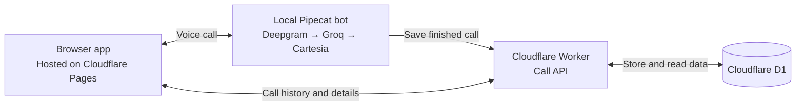

# Vaami — Mini Call Log Service

A web app where you talk to an AI voice agent and revisit the conversation afterward.
Built for the Vaami intern assessment.

[**Open the app**](https://vaaami-project.pages.dev) · [**Call history**](https://vaaami-project.pages.dev/#/calls) · [**GitHub Actions**](https://github.com/gamea333/vaaami_project/actions)

> The website and saved history are hosted on Cloudflare. Voice calls also need the
> local Pipecat bot and its tunnel running on the demo machine, as described below.

## What it does

- Start and end a voice call from the browser.
- Talk to the agent, ask follow-up questions and interrupt its response.
- Save the call ID, start/end times, duration, user/agent transcript and available latency measurements.
- Browse previous calls and open their transcript and metrics.

## Architecture

There are four main parts, following the assessment's architecture:



**How one call works:**

1. The browser checks microphone access before creating a bot session.
2. SmallWebRTC connects the browser's audio to the local Pipecat bot.
3. **Deepgram** converts your speech to text. **Groq** generates a reply using the conversation context. **Cartesia** converts the reply to speech.
4. When the call ends, the bot sends its transcript, timing and metrics to the Worker.
5. The Worker saves the data in D1. The bot reads it back to confirm the save succeeded.
6. The browser uses the Worker API to show the saved call in History.

The local bot uses FastAPI for session requests. An HTTPS tunnel lets the deployed
website reach it. The tunnel carries call-setup requests; WebRTC carries the audio.
Provider services are called by the bot, so their API keys stay out of the frontend.
D1 is the only persistent database. We save text and metrics, not audio recordings.

## Tech stack

| Part | Technology | Purpose |
| --- | --- | --- |
| Frontend | React, TypeScript, Vite | Call screen, history and call details |
| Frontend hosting | Cloudflare Pages | Publishes the website |
| Backend | Cloudflare Worker | Saves and retrieves calls |
| Database | Cloudflare D1 | Stores calls, transcripts and metrics |
| Local bot | Python, FastAPI, Pipecat | Runs the voice conversation |
| Speech-to-text | Deepgram | Turns speech into text |
| LLM | Groq | Generates replies |
| Text-to-speech | Cartesia | Turns replies into audio |
| Audio transport | SmallWebRTC | Connects browser audio to the bot |
| Deployment | Wrangler and GitHub Actions | Tests, migrations and deployment |

On the development machine, the Python bot runs in Ubuntu through WSL. This gives
its audio dependencies a Linux environment on Windows. WSL is our setup choice;
the assessment requires a local bot, not a particular operating system.

## Run locally

You need Node.js 22.12+, Python 3.12, uv, and Deepgram, Groq and Cartesia credentials.
For the Windows setup, install Ubuntu WSL2 and make uv available inside Ubuntu.

### 1. Set up the project

From PowerShell:

```powershell
git clone https://github.com/gamea333/vaaami_project.git
cd vaaami_project
npm ci
Copy-Item bot/.env.example bot/.env
Copy-Item apps/api/.dev.vars.example apps/api/.dev.vars
Copy-Item apps/web/.env.example apps/web/.env
```

Copy these files only on first setup; do not replace existing configured files.

Fill in `bot/.env` with:

- `DEEPGRAM_API_KEY`, `GROQ_API_KEY`, `CARTESIA_API_KEY` and `CARTESIA_VOICE_ID`.
- `DEMO_ACCESS_CODE`: a private code used to start calls from the browser.

Set `CALLS_INGEST_TOKEN` in `apps/api/.dev.vars` to a strong random secret. This
protects uploads from the bot to the Worker. Then run:

```powershell
npm run configure:bot --workspace=@vaami/api
npm run db:migrate --workspace=@vaami/api
```

The configuration command copies the ingestion token into the bot's settings and
sets the local API addresses. On Windows, it handles the WSL network address.
The migration command creates the local database tables.

### 2. Start the services

Run these in **two separate PowerShell terminals**, from the repository root:

```powershell
npm run dev:api
```

```powershell
npm run dev:web
```

In an **Ubuntu terminal**, open your checkout's `bot` folder and run:

```bash
cd /mnt/c/path/to/vaaami_project/bot
uv sync --locked --python 3.12
uv run python -m uvicorn server:app --host 127.0.0.1 --port 7860
```

Replace the example path with your actual checkout location. On Linux, run the
same uv commands directly from `bot/`.

Open http://127.0.0.1:5173, enter the demo code and allow microphone access. Make a
short call, end it, wait for **Saved and verified**, then open History.
Run one bot process without `--reload`. More bot details: [bot/README.md](bot/README.md).

## Using the deployed website

The hosted frontend, Worker and D1 stay on Cloudflare. The bot still runs locally.
To point the bot at this project's production API, run from the repository root:

```powershell
node scripts/configure-production.mjs https://vaami-call-log-api-production.mehraaditya777.workers.dev https://vaaami-project.pages.dev
```

Ensure the bot and Worker have the same ingestion token. Finish any pending saves
before restarting the bot with these settings. Start the bot as above, then start
an HTTPS tunnel in a separate terminal:

```powershell
cloudflared tunnel --url http://127.0.0.1:7860 --no-autoupdate
```

On the original demo machine, cloudflared is also available at `.\.tools\cloudflared.exe`.
Set the tunnel's HTTPS URL as GitHub repository variable `VITE_BOT_BASE_URL` and run
the deployment workflow again. Keep both the bot and tunnel running during the demo.

**A restarted Quick Tunnel gets a new URL.** Update the variable and redeploy when
that happens. The local and production databases contain separate call histories.
Optional STUN helps WebRTC find network addresses; some networks need a TURN relay,
which this demo does not configure.

## API and database

| API | Purpose |
| --- | --- |
| `POST /calls` | Save a finalized call; requires the ingestion token |
| `GET /calls` | List calls, with pagination |
| `GET /calls/:id` | Get one call's metadata, transcript and metrics |

D1 has three tables: `calls`, `transcripts` and `call_metrics`.
See the [schema](apps/api/migrations/0001_init.sql) and [example payload](packages/contracts/call.example.json).

Repeated uploads of the same call do not create duplicates. Failed saves have
bounded retries and can be recovered from bot memory before restarting it.
Latency is displayed in milliseconds; missing measurements show **Not captured**.
History reads are public for this demo, so it is not intended for confidential calls.

## Deployment and logs

The [GitHub Actions workflow](.github/workflows/deploy.yml) runs checks on pull requests
and pushes to `main`. On `main`, after checks pass, it:

1. Applies production D1 migrations.
2. Deploys the Worker.
3. Builds and deploys the frontend to Pages.
4. Checks that the deployed API, database reads and frontend respond correctly.

| Deployment setting | Where it goes |
| --- | --- |
| Cloudflare deployment token | GitHub secret `CLOUDFLAREAPI` |
| Public Worker, bot and frontend URLs | GitHub variables `VITE_API_BASE_URL`, `VITE_BOT_BASE_URL`, `PAGES_URL` |
| Bot upload secret | Worker secret `CALLS_INGEST_TOKEN`, matching `bot/.env` |

For another Cloudflare account, create a D1 database and Pages project, then update
the account/database IDs, project name and allowed frontend origin in the
[Wrangler configuration](apps/api/wrangler.jsonc) and workflow. Provision the Worker secret with:

```powershell
npx wrangler secret put CALLS_INGEST_TOKEN --env production --config apps/api/wrangler.jsonc
```

Private keys belong in ignored environment files or secrets, never in frontend
`VITE_` variables. Those variables are visible in the built website.

Observability is enabled. In Cloudflare, open **Workers & Pages →
vaami-call-log-api-production → Observability** to inspect request/error information.
Application logs include request IDs, call IDs, status and elapsed time, without
transcript text or credentials.

## Testing and demo

```powershell
npm run typecheck
npm run build
npm run test --workspace=@vaami/web
npm run test --workspace=@vaami/api
```

From `bot/` in Ubuntu, run `uv run python -m pytest -q`.
The automated suite has **23 frontend, 13 Worker and 32 bot tests** and uses fake
providers to avoid spending speech credits.

The project owner confirmed live voice and saved history, and reported the other
manual checks passed: hangup, interruptions, unavailable bot, navigation and narrow
layout. Microphone denial exposed a bug; it is now fixed and covered by automated
tests. A fresh deployed-browser denial check remains pending.

For the assessment demo: **make a call → interrupt a reply → end the call → open
its transcript and metrics → find its call ID in Cloudflare logs**. Keep a successful
Actions run ready to show as well.

## Decisions, tradeoffs and improvements

- **Local Pipecat:** follows the assessment and keeps provider keys server-side, but the demo depends on the local machine being online.
- **SmallWebRTC:** avoids needing a Daily account; network connectivity still needs testing on the demo machine.
- **D1 and verified saves:** keep persistent data in one database and make retries safe. A bot crash can still lose an unfinished in-memory save.
- **Short calls and usage limits:** help conserve free-tier credits. Defaults are 120 seconds per call, 30 seconds idle, eight LLM requests and 1200 TTS characters. Restarting the bot resets its process budget; these limits do not guarantee provider balances.
- **Shared demo code:** limits who can start calls, but it is not a full user-account system. Optional browser remembering should be used only on a trusted device.

With more time, I would add durable recovery for unfinished saves, private per-user
history, a stable bot address and TURN support, followed by better latency analysis.

## Where to read the code

| Folder or file | Responsibility |
| --- | --- |
| `apps/web/src/App.tsx` | Call controls and navigation |
| `apps/web/src/History.tsx` | History and call details |
| `apps/web/src/lib/voice.ts` | Microphone, connection and cleanup |
| `apps/api/src/` | API routes, validation and D1 queries |
| `bot/server.py`, `bot/session.py` | Session requests and call lifecycle |
| `bot/pipeline.py`, `bot/guards.py` | Voice pipeline and usage limits |
| `bot/persistence.py`, `bot/api_client.py` | Save payload, retries and verification |
| `.github/workflows/deploy.yml` | Automated checks and deployment |
